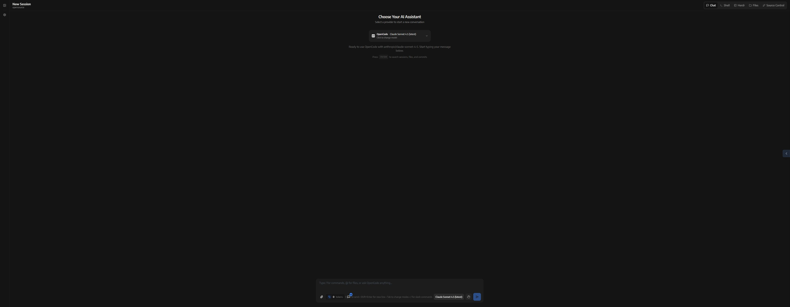

# WindCli

A web-based UI for Claude Code, Codex, Cursor CLI, OpenCode, and Pi Coding Agent.



WindCli is an independent secondary-development project based on
[siteboon/claudecodeui](https://github.com/siteboon/claudecodeui). We are
grateful to the original project and its contributors for the foundation.

## Run locally

Requires Node.js 22 or newer.

Pi support uses the external `pi` executable from
`@earendil-works/pi-coding-agent` 0.84.2 or newer. Install it separately and
authenticate a model in the Pi TUI with `/login` (or configure the relevant
provider environment variable). WindCli does not read or manage upstream API
keys. Pi sessions are discovered from `PI_CODING_AGENT_SESSION_DIR`, then the
global Pi `sessionDir` setting, then `~/.pi/agent/sessions`.

```sh
npx wind-agent-cli
```

Or install the command globally:

```sh
npm install -g wind-agent-cli
wacli
```

Update a global installation to the latest stable release:

```sh
wacli update
```

Open `http://localhost:3001` after the server starts.

For configuration, desktop builds, sandbox support, and development instructions, see the [full documentation](https://github.com/CaineWind/wacli/blob/main/docs/README.md).

## Progressive Web App

WindCli can be installed from a supported desktop or mobile browser. The PWA
caches the versioned application shell and static assets, provides an explicit
new-version reload prompt, and keeps Web Push notification navigation working
in the installed app.

The interface can reopen offline after it has loaded successfully once. Agent
runs, project data, terminals, and other server-backed operations still require
the WindCli server to be reachable.

## License

AGPL-3.0-or-later
